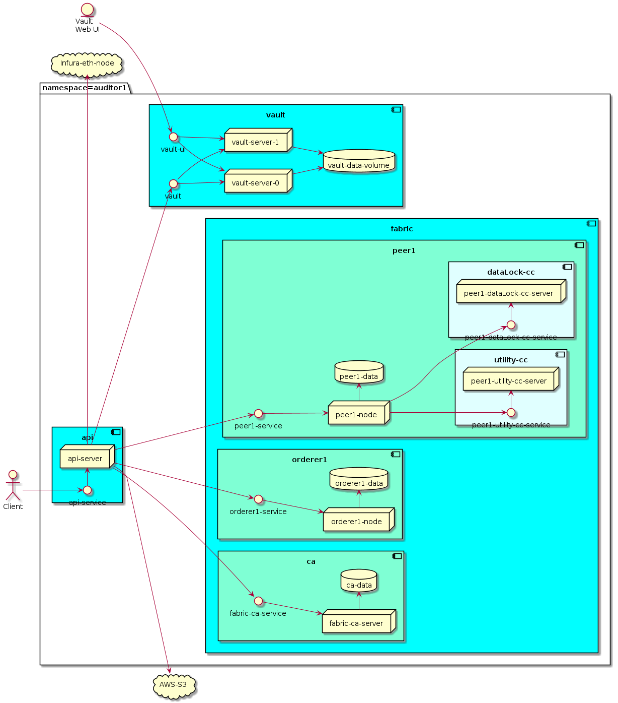
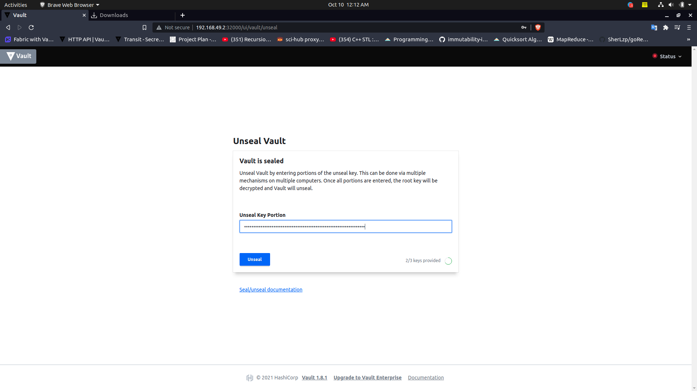

# Minikube Setup

This is a doc, describing deployment of all the components of utility emissions channel using Kubernetes via minikube. Two organizations `auditor1` and `auditor2` are deployed under two different k8s's namespace, making the deployment steps same for a non-minikube cluster. In a actual k8s cluster, each auditor namespace will represents a Kubernetes cluster maintained that auditor organization.

- [Minikube Setup](#minikube-setup)
  - [Deployment](#deployment)
  - [Prerequisite](#prerequisite)
  - [Components](#components)
    - [Vault](#vault)
      - [Auditor1](#auditor1)
      - [Auditor2](#auditor2)
      - [Configuration](#configuration)

## Deployment



This is a deployment architecture for `namespace=auditor1` (will be same for `auditor2`). Each servers/node and respective service are divided into unique componeents, three of which are

- api : contains api servers (`api-server`) and external service (`api-service`) for client to interact with the server. `api-server` connects with other components via their services.
- vault : contains vault servers (as `stateFulSet`) , internal headLess service`vault` and external service `vault-ui`. Internal headLess service is used by `api-server` to perform task on vault servers. External service `vault-ui` exposes vault ui endpoints for org's to perform administrative tasks.
- fabric : contains fabric related servers/nodes and service, this component is further divided into multiple components
  - ca : contains org's ca server `fabric-ca-server`, internal service `fabric-ca-service` and volume `ca-data`.
  - orderer1 : contains orderer1's node, external service `orderer1-service` and Volume `orderer1-data`.
  - peer1 :  contains peer1's node, external service `peer1-service`, two chaincode (`EmissionsCC` and `dataLockCC`) component and Volume `peer1-data`.

## Prerequisite

- Running minikube : `minikube start`
- Create Persistent Volume : `kubectl apply -f configs/persistent-volume.yaml`
- Create auditor1 namespace : `kubectl apply -f configs/auditor1/namespace.yaml`
- Create auditor2 namespace : `kubectl apply -f configs/auditor2/namespace.yaml`

## Components

### Vault

#### Auditor1

Start Vault server `kubectl apply -f configs/auditor1/vault.yaml`

**Status**

```terminal
$ kubectl get pods -n auditor1
NAME             READY   STATUS    RESTARTS   AGE
vault-server-0   1/1     Running   0          3m36s
vault-server-1   1/1     Running   0          2m30s
```

Expose external service `vault-ui` for accessing web vault ui : `minikube service vault-ui -n auditor1`, vault web ui running port : 32000

#### Auditor2

Start Vault server : `kubectl apply -f configs/auditor2/vault.yaml`

**Status**

```terminal
$ kubectl get pods -n auditor2
NAME             READY   STATUS    RESTARTS   AGE
vault-server-0   1/1     Running   0          3m36s
vault-server-1   1/1     Running   0          2m30s
```

Expose external service `vault-ui` for accessing web vault ui : `minikube service vault-ui -n auditor2`, vault web ui running port : 32001

#### Configuration

This is a common step to be performed for both the organizations. Vault store all its data in a encrypted form, so whenever vault server starts it need to know the decryption key. vault uses Shamir's Secret Sharing to break the decryption key into multiple part, such that a threshold number of key part is required in-order to reconstruct the secret key. When vault server starts for the first time, the key pats along with root token are generated as initialization step. The generated key parts should be kept securely, since they are required whenever vault server restarts.

- Initialization


- Save Generated Key


- Unseal Vault by Providing threshold number of key parts

