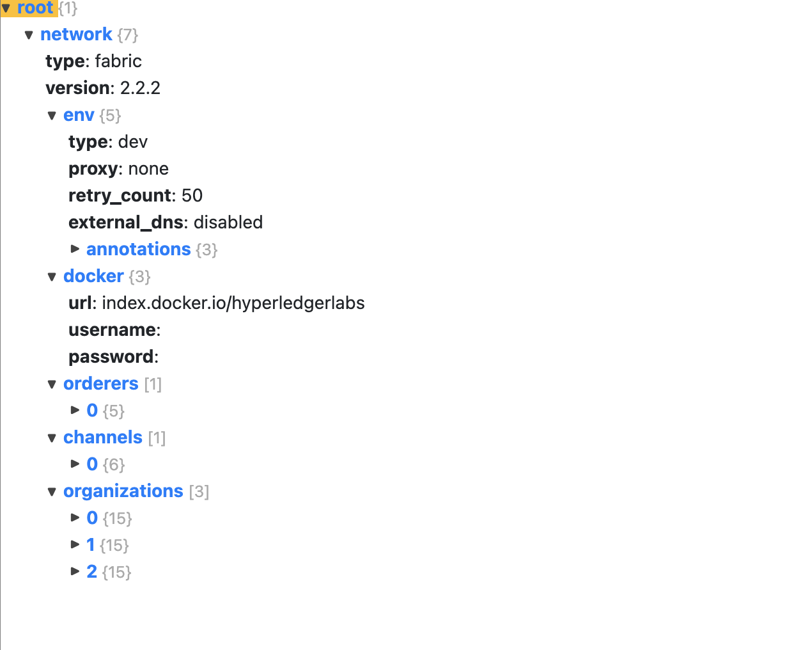

# Fabric network setup using bevel

## Prerequsite
1. Vault Server
2. Kubernetes cluster - kubeconfig file

## Network Configuration
create a network.yaml file and define the following properties
1. Peer organisation
2. Ordering organisation
3. Channel
4. Certificate Authority 
5. Gitops configuration
6. Vault configuration
7. Container Registry
8. Kubernetes config file

## Network configuration file structure


## Starting bevel network
```
docker run -it -v $(pwd):/home/bevel/ --network="host" ghcr.io/hyperledger/bevel-build:latest bash

# go to bevel directory
cd bevel
# Run the provisioning scripts
ansible-playbook  platforms/shared/configuration/site.yaml -e "@./build/network.yaml"
```
