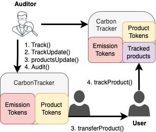

# CarbonTracker token and Contract:

## Deploying the emission certificate contract and interface

Here we summarize the deployment process deploying the CarbonTracker contract and DAPP interface. This covers installation and configuration of software in different subdirectoreis of blockchain-carbon-accouting repository. You'll need to make sure you are running version of node >= 16.x.x

First run `npm install` of dependency libraries in the following subdirectories
 
- [data](https://github.com/hyperledger-labs/blockchain-carbon-accounting/blob/main/data)This is where the postgres server and tables are configured for convenient storage for on and off-chain data. Follow the [readme](https://github.com/hyperledger-labs/blockchain-carbon-accounting/blob/main/data/README.md) for instructions on setting up and seeding the postgres database.

- Next run the hardhat node in hardhat subdirectory where the contracts (NET &CarbonTracker) are deployed
```
npx hardhat node
```
[using-the-react-applicaiton readme](https://github.com/hyperledger-labs/blockchain-carbon-accounting/blob/main/hardhat/docs/using-the-contracts.md) provides instructions on seeding the network, e.g.:
```npx hardhat setTestAccountRoles --network localhost --contract <NetEmissionsTokeNetwork address>``` 
to assign roles to network addresses.

```npx hardhat issueOilAndGasTrackers --network localhost --contract <NetEmissionsTokeNetwork address> --contract <CarbonTracker address>``` 
to issue example tracker tokens for oil and gas producers.

- Run the api-server for synchronizing postgres database with contract state in app/api-server
```npm run dev``` 
[README](https://github.com/hyperledger-labs/blockchain-carbon-accounting/blob/main/app/api-server/README.md) provides instructions on seeding the postgres database with user and other data.

- Run the node.js react UI
```
cd app/frontend/react-app
npm run build
```

## Setup demo tokens for U.S. Oil & Gas production data

Follow [these instructions](https://github.com/hyperledger-labs/blockchain-carbon-accounting/blob/main/app/methane/README.md#oil-and-gas-data) on seeding the postgres database tables with data for oil and gas operators and their products.

With this data the following task can be used to seed the desired network with data lodaded from the [The Sustainability Institute](https://www.sustainability.com/thinking/benchmarking-methane-ghg-emissions-oil-natural-gas-us/)

```
hardhat oilAndGasBenchmarkBasins --network localhost --contract <NetEmissionsTokeNetwork address> --tracker <CarbonTracker address>
```

The database includes other public data data sources for flaring of methane gas by oil and gas producers that can be compared against the tokens issued above for accuracy using the Methane App. Following the instructions in [app/methane/](https://github.com/hyperledger-labs/blockchain-carbon-accounting/tree/main/app/methane#methane-emissions-reduction-app)

```npm run server```

```npm run client```


## ERC721 contract for carbon tracker NFTs

The Carbon Tracker Contract is used to issue non fungible tokenz (NFT) as emission certificates of a facility that produces industrial commodities or a commerical service such as international travel and transportation of goods.

The contract is implemented as ERC1155Holder of the [NET contract](https://github.com/hyperledger-labs/blockchain-carbon-accounting/blob/main/hardhat/contracts/NetEmissionsTokenNetwork.sol). Each Carbon Tracker NFT describes the unique emission profile of a product/facility using different NET types as inputs/outputs:
    
- emission tokens (tokenTypeId = 4 as transferable emission tokens) 
- offset credits (retired or transferable)
- Renewable energy certificates

Each NFT is assigned product tokens used for tracking embodied emissions in trade of products and services. Multiple product tokens are issued to a certicate to describe the ditribution across a facility with multiple product types (e.g. a refinery that produces gasoline and deisel).

The follwoing figure illustrates the features of the CarbonTracker contract. 




Auditors setup CarbonTracker tokens as emission certificates for a registered industry account.
- track() to create, or trackUpdate() to update an existing, tracker by assigning NETs.
- productsUpdate() to assign unique product amounts to a tracker.
- audit() to mark a tracker as Audited approve an industry'd emission certificate

Registered industry can use the CarbonTracker allow its products to be transfered to other accounts
- transferProduct() to another trackee, customer, auditor, ...
- The entire audited CarbonTracker can  be transffered, e.g., to an emission certificate dealer, ...
- trackProduct() track a previously issued product to a new tracker ID. Enabables tracking embodiied emission of a products accross product across a supply chain.

 See the [CarbonTracker NFT example](#carbon-tracker-nft-example).


### Attribute description  

Each NFT is defined by a unique trackerId with the following attribtues:
- `_trackerData` details about the certificate
- `_trackerMappings` listing all the emission and products tokens issued to the certificate

`_trackerMappings` can also list  products tracked from other trackers as a way to bootstrap the emission certificate of derived products.

## Carbon tracker NFT applications

This service target industries, and their supply chain counterparts, with commercial advantage (and/or policy mandate) to provide embedded emission transparency. 

For example, the [Carbon Border Adjustement Mechanism drafted by the European Commission](https://ec.europa.eu/info/sites/default/files/carbon_border_adjustment_mechanism_0.pdf). It requires importers of targeted energy intensive commodities (e.g., steel, cement, alumininum, fertilizers) to disclose simple and complex (embedded) emissions. These will be subject to carbon import tariffs equivalent to the price of GHG allowances purchased under the European Unions Emission Trading System (EU ETS).  

Another application is the creation of emission performance certificates issued to fuel and other commodity producers. For exmaple, to certify that a producer has low gas flaring and methane leakage on its production. [Flare Intel](https://flareintel.com/) provoides a service that could be used to verify flaring from facilities on a global scale. The World Bank has also set up an [Imported Flared Gas (IFG) index](https://www.ggfrdata.org/#imported-flare-gas-index) as a measure of the embedded flared emission in international oil trade. The Carbon Tracker NFTs could be issued in conjunction with such an index to prove an importer has committed to lowering its IFG index.


