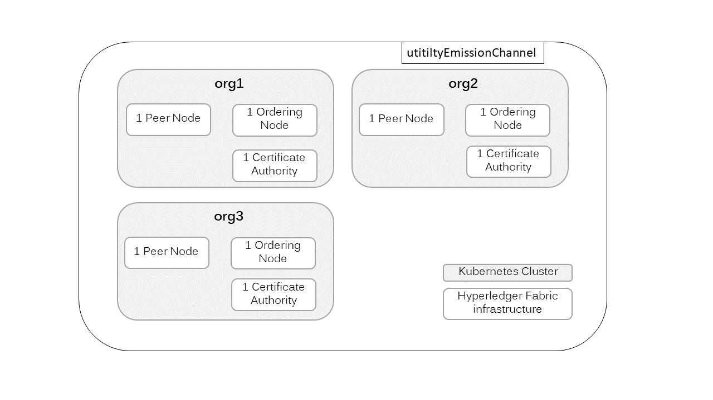

# Multi-cloud deployment of Hyperledger Fabric as a testNet for emissions accounting

## Index
   1. [Overview](README.md#1-overview)
   2. [Architecture](README.md#2-architecture)
   3. [Configuration](README.md#3-configuration)
   4. [Start Hyperledger Fabric network](README.md#5-start-hyperledger-fabric-network)
   5. [Monitor Hyperledger Fabric network](README.md#5-monitor-hyperledger-fabric-network)

## 1. Overview
This document describes how to get your Hyperledger Fabric infrastructure ready to run on Kubernetes and connect with different organizations that host their infrastructure in their own Kubernetes cluster. (as of 2020-12-09)

This readme file describes the deployment to a Kubernetes cluster hosted at Digital Ocean. If you want to deploy Hyperledger Fabric to AWS EKS follow the [instructions](./deploy-aws/README.md) in ./deploy-aws. 

## 2. Architecture
The following image shows a sample architecture of the multi-cloud deployment consisting of three organizations. The Hyperledger Fabric infrastructure of each organization is hosted separately in Kubernetes clusters.


The following image gives a high-level overview of the components of each organizations' Kubernetes cluster.


## 3. Prerequisites
#### 3.1 Domain Names
1. Create subdomains for fabric-ca, fabric-peer, and fabric-orderer, e.g., fabric-ca.emissionsaccounting.yourdomain.com
2. Link subdomains to nginx ingress IP address (at cluster management level) after you've started the nginx ingress as describe in step 3.2.
#### 3.2 Kubernetes
You need to have a running Kubernetes cluster. You need to deploy one nginx ingress controller to your Kubernetes cluster. 

###### Nginx Controller Config
Go to https://github.com/kubernetes/ingress-nginx/tree/master/deploy/static/provider and copy the `deploy.yaml` file to your filesystem according to your cloud provider.
In the `deploy.yaml` file add `--enable-ssl-passthrough` to the args section of the controller container. For an example, take a look at the deployment file [kubernetes-ingress-controller-deploy.yaml](https://github.com/opentaps/blockchain-carbon-accounting/blob/c20466ec19018fb1afac31c50e58455b9db7a944/multi-cloud-deployment/deploy-digitalocean/kubernetes-ingress-controller-deploy.yaml#L353) of the nginx ingress for DigitalOcean (do). 

##### Ingress Service Config
Next, you need to prepare your ingress to route the subdomains of your Hyperledger Fabric infrastructure with `nginx.ingress.kubernetes.io/ssl-passthrough: "true"`. As a starting point you can use `deploy-digitalocean/ingress-fabric-services-deployment.yaml´. 
Set the following values according to your setup:
- name: name-of-your-ingress
- host: sudomain-to-fabric-ca
- host: sudomain-to-fabric-peer
- host: sudomain-to-fabric-orderer
Of course, you can add additional rules for e.g. a second peer node.

#### 3.3 Fabric Binaries
Get fabric binaries in fabric version 2.2.1 and fabric-ca at version 1.4.9.
```shell
curl -sSL https://bit.ly/2ysbOFE | bash -s -- 2.2.1 1.4.9 -d -s
```

#### 3.4 Kubernetes Namespace
Create a separate namespace for the deployment of the ignress instance and all hyperledger fabric related stuff. Adjust the value of `name` in `./deploy-digitalocean/fabric-namespace.yaml` according to your preferences (here: fabric) and then apply the configuration as follows:
```shell
# Create namespace
kubectl apply -f ./deploy-digitalocean/fabric-namespace.yaml

# Should print a similar output
namespace/fabric created
```

## 4. Start Hyperledger Fabric network
#### 4.1. Crypto-material
The following step to accomplish to start your organizations' infrastructure of the multi-cloud Hyperledger Fabric network is to generate the crypto-material. We use fabric certificate authority (ca) for this. Each organization has its own fabric-ca.

1. Configure `./fabric-config/fabric-ca-server-config.yaml`
change the values of:
- fabric-ca-subdomain
- ca-admin
- ca-admin-password (Use a strong password and keep it safe)
- your-organization
- names (C, ST, L, O, OU) --> This is optional but recommended
2. Create configmap
Change value of `yournamespace`.
```shell
# Create fabric-ca-server configmap
kubectl create cm fabric-ca-server-config --from-file=./fabric-config/fabric-ca-server-config.yaml -n yournamespace

# Should print a similar output
configmap/fabric-ca-server-config created
```
3. Adjust the deployment configuration of `./deploy-digitalocean/fabric-ca-deployment.yaml` according to your cloud provider. 
4. Start fabric-ca
Change value of `yournamespace`.
```shell
# Start fabric-ca
kubectl apply -f ./deploy-digitalocean/fabric-ca-deployment.yaml -n yournamespace

# Should print a similar output
service/fabric-ca created
persistentvolumeclaim/fabric-ca created
deployment.apps/fabric-ca created
```
5. Copy fabric-ca tls certificate
Get the name of the fabric-ca pod. Copy tls certificate to local file system. Change value of `yournamespace`.
```shell
# Export fabric ca client home; change <your-domain>, e.g., `emissionsaccounting.sampleOrg.de`

mkdir -p ${PWD}/crypto-material/<your-domain>/fabric-ca
e.g. ${PWD}/crypto-material/emissionsaccounting.sampleOrg.de/fabric-ca/tls-cert.pem

export FABRIC_CA_CLIENT_HOME=${PWD}/crypto-material/<your-domain>/fabric-ca
export FABRIC_CA_CLIENT_TLS_CERTFILES=${PWD}/crypto-material/<your-domain>/fabric-ca/tls-cert.pem

# Returns all pods of yournamespace
kubectl get pod -n yournamespace
# Should print a similar output
NAME                        READY   STATUS    RESTARTS   AGE
fabric-ca-6884b9dc5-86894   1/1     Running   0          16m


# Copy tls-cert.pem from fabric-ca pod (here: fabric-ca-6884b9dc5-86894)
kubectl cp "<fabric-ca-pod>:/etc/hyperledger/fabric-ca-server/tls-cert.pem" "${FABRIC_CA_CLIENT_HOME}/tls-cert.pem" -n yournamespace
```
6. Configure ingress (Skip this step if this already happened)
Adjust the deployment configuration of `./deploy-digitalocean/ingress-fabric-services-deployment.yaml` 
Change:
- name: name-of-your-ingress
- host: sudomain-to-fabric-ca

Apply deployment configuration.
```shell
# Change path to fabric-services-ingress-deployment.yaml and yournamespace.
kubectl apply -f ./deploy-digitalocean/ingress-fabric-services-deployment.yaml -n yournamespace
```
7. Generate crypto-material
Set input variables of `registerEnroll.sh` according to your organizations configuration
Run the script
```shell
# Register and enroll peer, oderer and org admin
./registerEnroll.sh

# Check the logs and confirm that you don't get any error messages
```
#### 4.2. Orderer
Once all the crypto material is created, we can start the orderer.

1. Create orderer genesis block 
NOTE: For testing purposes, change the values of `configtx.yaml` in fabric-config. This is just a way for you to test the functionality of your configuration before you try to start interacting with nodes from different organizations. Values to change:
- Name of the organization (sampleorg)
- Subdomain of peer and orderer (e.g. OrdererEndpoints, AnchorPeers, and Consenters.Host)
- Paths of Consenters.ClientTLSCert and Consenters.ServerTLSCert

Changes the values accordingly your setup, e.g., `-n yournamespace`
```shell
# use configtxgen to create orderer.genesis.block
./bin/configtxgen -profile MultiNodeEtcdRaft -channelID system-channel -outputBlock ./system-genesis-block/orderer.genesis.block -configPath ./fabric-config

# Should print a similar output
2021-01-06 17:46:26.426 CET [common.tools.configtxgen] main -> INFO 001 Loading configuration
[...]
2021-01-06 17:46:26.455 CET [common.tools.configtxgen] doOutputBlock -> INFO 005 Writing genesis block


# create configmap of orderer.genesis.block
kubectl create cm system-genesis-block  --from-file=./system-genesis-block/orderer.genesis.block -n yournamespce

# Should print a similar output
configmap/system-genesis-block created
```

2. Create secret of crypto-material
Next we need to create a secret that contains all the crypto-material of the orderer (msp and tls). Change the path to crypto-material of orderer and Kubernetes namespace.
```shell
mkdir tmp-crypto
cd tmp-crypto
# pack crypto-material of orderer into one *.tgz file (example of path: "/Users/user1/Documents/GitHub/blockchain-carbon-accounting/multi-cloud-deployment/crypto-material/emissionsaccounting.yourdomain.com/orderers/fabric-orderer1.emissionsaccounting.yourdomain.com")
tar -zcf "orderer1-crypto.tgz" -C "absolute path to fabric-orderer1.emissionsaccounting.yourdomain.com" .

# create secret of *.tgz file
kubectl create secret generic orderer1-crypto --from-file=orderer1-crypto=orderer1-crypto.tgz -n yournamespace

# Should print a similar output
secret/orderer1-crypto created

# Change dir to multi-cloud-deployment
cd -
```

3. Start orderer
Now it's time to start the orderer. Apply `./deploy-digitalocean/fabric-orderer-deployment.yaml` to your cluster.  
```shell
# Set path to fabric-orderer-deployment.yaml and change yournamespace
kubectl apply -f ./deploy-digitalocean/fabric-orderer-deployment.yaml -n yournamespace

# Should print a similar output
service/fabric-orderer1 created
persistentvolumeclaim/fabric-orderer1 created
deployment.apps/fabric-orderer1 created


# Wait for 2 minutes and check if orderer is running
kubectl get pod -n yournamespace

# Should print a similar output
NAME                               READY   STATUS    RESTARTS   AGE
fabric-ca-6884b9dc5-zjxrz          1/1     Running   0          11m
fabric-orderer1-56688dbbdc-r42ps   1/1     Running   0          106s
```

#### 4.3. Peer
Now it's time to start (and test) the peer node. 

1. First, edit `./deploy-digitalocean/fabric-peer-deployment.yaml` and change the following values according to your configuration:

ENV section of peer container:
- CORE_PEER_ADDRESS
- CORE_PEER_CHAINCODEADDRESS
- CORE_PEER_GOSSIP_BOOTSTRAP
- CORE_PEER_GOSSIP_EXTERNALENDPOINT
- CORE_LEDGER_STATE_COUCHDBCONFIG_USERNAME
- CORE_LEDGER_STATE_COUCHDBCONFIG_PASSWORD

ENV section of couchDB container:
- COUCHDB_USER
- COUCHDB_PASSWORD

2. Create secret of crypto-material
Next we need to create a secret that contains all the crypto-material of the peer (msp and tls). Change the path to crypto-material of peer and Kubernetes namespace.
```shell
mkdir -p tmp-crypto
cd tmp-crypto
# pack crypto-material of orderer into one *.tgz file (example of path: "/Users/user1/Documents/GitHub/blockchain-carbon-accounting/multi-cloud-deployment/crypto-material/emissionsaccounting.yourdomain.com/peers/fabric-peer1.emissionsaccounting.yourdomain.com")
tar -zcf "peer1-crypto.tgz" -C "absolute path to fabric-peer1.emissionsaccounting.yourdomain.com" .

# create secret of *.tgz file; change value of yournamespace
kubectl create secret generic peer1-crypto --from-file=peer1-crypto=peer1-crypto.tgz -n yournamespace

# Should print a similar output
secret/peer1-crypto created


# Change dir to multi-cloud-deployment
cd -
```

3. Create configmap of channel artifacts
In order to pass the channel artifacts of the first channel, we package them into a configmap which we'll mount to the pod. Changes the value of yournamespace.
```shell
# run the tool configtxgen with the sample confitgtx.yaml file you created in section 1 of chapter 4.2 to create channel artifacts
./bin/configtxgen -profile MultipleOrgsChannel -outputCreateChannelTx ./channel-artifacts/utilityemissionchannel.tx -channelID utilityemissionchannel -configPath ./fabric-config

# Should print a similar output
2021-01-06 17:58:06.505 CET [common.tools.configtxgen] main -> INFO 001 Loading configuration
[...]
2021-01-06 17:58:06.536 CET [common.tools.configtxgen] doOutputChannelCreateTx -> INFO 004 Writing new channel tx


# Create configmap of channel tx
kubectl create cm utilityemissionchannel  --from-file=./channel-artifacts/utilityemissionchannel.tx -n yournamespace

# Should print a similar output
configmap/utilityemissionchannel created
```

4. Create configmap of anchor peers update
Next, we create a second configmap of the peer nodes which contains the information about the anchor peer. Changes the values of yournamespace, sampleOrg, and sampleorganchors.
```shell
# run the tool configtxgen with the sample confitgtx.yaml file you created in section 1 of chapter 4.2 to create anchros peers update.
./bin/configtxgen -profile MultipleOrgsChannel -outputAnchorPeersUpdate ./channel-artifacts/sampleOrganchors.tx -channelID utilityemissionchannel -asOrg sampleOrg -configPath ./fabric-config

# Should print a similar output
2021-01-06 17:59:17.746 CET [common.tools.configtxgen] main -> INFO 001 Loading configuration
[...]
2021-01-06 17:59:17.768 CET [common.tools.configtxgen] doOutputAnchorPeersUpdate -> INFO 004 Writing anchor peer update

# create configmap of anchor peer update
kubectl create cm sampleorganchors --from-file=./channel-artifacts/sampleOrganchors.tx -n yournamespace

# Should print a similar output
configmap/sampleorganchors created
```

3. Start peer
Now it's time to start the peer. Apply `./deploy-digitalocean/fabric-peer-deployment.yaml`to your cluster.  
```shell
# Change value of yournamespace
kubectl apply -f ./deploy-digitalocean/fabric-peer-deployment.yaml -n yournamespace

# Should print a similar output
service/fabric-peer1 created
persistentvolumeclaim/fabric-peer1 created
deployment.apps/fabric-peer1 created


# Wait for 2 minutes and check if peer is running
kubectl get pod -n yournamespace

# Should print a similar output
NAME                               READY   STATUS    RESTARTS   AGE
fabric-ca-6884b9dc5-zjxrz          1/1     Running   0          20m
fabric-orderer1-56688dbbdc-r42ps   1/1     Running   0          10m
fabric-peer1-6c89fd57d4-8w8z8      2/2     Running   0          28s
```

#### 4.4. Test your infrastructure against the test configuration
In this step, we'll create a channel in your running Hyperledger Fabric network consisting of 1 fabric-ca, 1 orderer node, and 1 peer node. Also, we will make the peer join the created channel.
1. Set ENV variables
Open `setEnv.sh` and set the values of the ENVs according to your setup.
```shell
# sourve ENVs
source ./setEnv.sh

# Should print a similar output
+++++ENVs are set+++++
```

2. Create Channel
Run the command `peer channel create` and the value of yourdomain

```shell
./bin/peer channel create -o ${ORDERER_ADDRESS} -c utilityemissionchannel -f ./channel-artifacts/utilityemissionchannel.tx --outputBlock ./channel-artifacts/utilityemissionchannel.block --tls --cafile ${ORDERER_TLSCA}

# Should print a similar output
2021-01-06 18:08:08.775 CET [channelCmd] InitCmdFactory -> INFO 001 Endorser and orderer connections initialized
2021-01-06 18:08:09.136 CET [cli.common] readBlock -> INFO 002 Expect block, but got status: &{NOT_FOUND}
2021-01-06 18:08:09.359 CET [channelCmd] InitCmdFactory -> INFO 003 Endorser and orderer connections initialized
2021-01-06 18:08:09.679 CET [cli.common] readBlock -> INFO 004 Expect block, but got status: &{SERVICE_UNAVAILABLE}
2021-01-06 18:08:10.063 CET [channelCmd] InitCmdFactory -> INFO 005 Endorser and orderer connections initialized
2021-01-06 18:08:10.280 CET [cli.common] readBlock -> INFO 006 Expect block, but got status: &{SERVICE_UNAVAILABLE}
2021-01-06 18:08:10.540 CET [channelCmd] InitCmdFactory -> INFO 007 Endorser and orderer connections initialized
2021-01-06 18:08:10.775 CET [cli.common] readBlock -> INFO 008 Received block: 0
```

3. Join Peer1 to Channel
Run the command `peer channel join`
```shell
./bin/peer channel join -b ./channel-artifacts/utilityemissionchannel.block

# Should print a similar output
2021-01-06 18:11:23.889 CET [channelCmd] InitCmdFactory -> INFO 001 Endorser and orderer connections initialized
2021-01-06 18:11:24.392 CET [channelCmd] executeJoin -> INFO 002 Successfully submitted proposal to join channel
```

4. Verify that peer has joind the channel
```shell
./bin/peer channel list

# Should print similar output to
2021-01-06 18:11:43.755 CET [channelCmd] InitCmdFactory -> INFO 001 Endorser and orderer connections initialized
Channels peers has joined: 
utilityemissionchannel
```
- 
## 5. Monitor Hyperledger Fabric network
