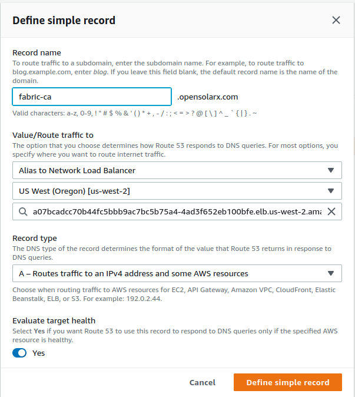

# AWS deployment of Hyperledger Fabric

This is AWS specific deployment steps in addition to the main guide


## 3. Prerequisites
#### 3.1 Kubernetes
You need to have a running Kubernetes cluster. You need to deploy one nginx ingress controller to your Kubernetes cluster. 

###### Create namespaces

```bash
kubectl create -f ./namespace-fabric-production.json
```

###### Nginx Controller Config
Go to https://github.com/kubernetes/ingress-nginx/tree/master/deploy/static/provider and copy the `deploy.yaml` file to your filesystem according to your cloud provider.

In the `deploy.yaml` file add `--enable-ssl-passthrough` to the args section of the controller container. 

**For AWS you may use `/deploy-aws/ kubernetes-ingress-controller-deploy.yaml`**

```sh
kubectl apply -f ./kubernetes-ingress-controller-deploy.yaml
```

#### 3.2 Domain Names
1.1. Create subdomains on Route 53 for fabric-ca, fabric-peer, and fabric-orderer, e.g., fabric-ca.emissionsaccounting.yourdomain.com

1.2. Link subdomains to nginx ingress IP address ( at cluster management level) after you you started the nginx ingress as describe in step 3.2.

AWS: set up Route 53 to have your domain pointed to the NLB

`fabric-ca.emissionsaccounting.<your-domain>.           A.    ALIAS abf3d14967d6511e9903d12aa583c79b-e3b2965682e9fbde.elb.us-east-1.amazonaws.com `



##### Ingress Service Config
Next, you need to prepare your ingress to route the the subdomains of your Hyperledger Fabric infrastructure with `nginx.ingress.kubernetes.io/ssl-passthrough: "true"`. 

**For AWS you can use `/deploy-aws/ingress-fabric-services-deployment.yaml`**

```sh
kubectl apply -f ./ingress-fabric-services-deploy.yaml
```

Set the following values according to your setup:
- name: name-of-your-ingress
- host: sudomain-to-fabric-ca
- host: sudomain-to-fabric-peer
- host: sudomain-to-fabric-orderer
Of course, you can add additional rules for e.g. a second peer node.

## 4. Start Hyperledger Fabric network
#### 4.1. Crypto-material
The following step to accomplish to start the multi-cloud Hyperledger Fabric network or even your organizations' infrastructure is to generate the crypto-material. We use fabric certificate authority (ca) for this. Each organization has its own fabric-ca.

1. Configure `./deploy-aws/fabric-config/fabric-ca-server-config.yaml`
change the values of:
- fabric-ca-subdomain
- ca-admin
- ca-admin-password (Use a strong password and keep it safe)
- your organization
2. Create configmap
Change value of namespace.
```shell
kubectl create cm fabric-ca-server-config --from-file=./fabric-config/fabric-ca-server-config.yaml -n fabric-production
```
   3.  Adjust the deployment configuration of `./deploy-aws/fabric-ca-deployment.yaml`. 

Take a closer look at the PVC section.

On AWS you would need to create a static ebs volume.

https://rtfm.co.ua/en/kubernetes-persistentvolume-and-persistentvolumeclaim-an-overview-with-examples/

```bash
aws ec2 --profile <aws_profile> --region <us-west-2> create-volume --availability-zone <us-west-2a> --size 1
# aws ec2 --profile opensolar --region us-west-2 create-volume --availability-zone us-west-2a --size 1
```
Update `PersistentVolume` `./fabric-ca-deployment.yaml` with volumeID of created ebs.

NOTE: if you re-initializing the setup you should delete old `ebs` and create a new ones as it stores old configs. 

4. Start fabric-ca
```shell
kubectl apply -f ./fabric-ca-deployment.yaml -n fabric-production
```
5. Copy fabric-ca tls certificate

 - Get the name of the fabric-ca pod

- Copy tls certificate to local file system
```shell
# Export fabric ca client home; change <your-domain>, e.g., `emissionsaccounting.sampleOrg.de`

mkdir -p ${PWD}/crypto-material/opensolarx.com/fabric-ca

export FABRIC_CA_CLIENT_HOME=${PWD}/crypto-material/opensolarx.com/fabric-ca

export FABRIC_CA_CLIENT_TLS_CERTFILES=${PWD}/crypto-material/opensolarx.com/fabric-ca/tls-cert.pem

# Returns fabric-ca pod of yournamespce
kubectl get pod -n fabric-production | grep fabric-ca

# Copy tls-cert.pem
kubectl cp "<fabric-ca-pod>:/etc/hyperledger/fabric-ca-server/tls-cert.pem" "${FABRIC_CA_CLIENT_HOME}/tls-cert.pem" -n fabric-production
```
6. Configure ingress (Skip this step if this already happened)
Adjust the deployment configuration of `./ingress-fabric-services-deploy.yaml` 
Change:
- name: name-of-your-ingress
- host: sudomain-to-fabric-ca

Apply deployment configuration.
```shell
kubectl apply -f ./ingress-fabric-services-deploy.yaml -n fabric-production
```
7. Generate crypto-material
Set input variables of `registerEnroll.sh` according to your organizations configuration

Get fabric binaries

```bash
curl -sSL https://bit.ly/2ysbOFE | bash -s -- -d -s
```

Run the script
```shell
./registerEnroll.sh
```
#### 4.2. Orderer
Once all the crypto material is created, we can start the orderer.

1. Create orderer genesis block 
NOTE: For testing purposes, change the values of `/fabric-config/configtx.yaml`. This is just a way for you to test the functionality of your configuration before you try to start interacting with nodes from different organizations. Values to change:
- Name of the organization (sampleorg)
- Subdomain of peer and orderer

Changes the values accordingly your setup, e.g., `-n fabric-production`
```shell
# use configtxgen to create orderer.genesis.block
./bin/configtxgen -profile MultiNodeEtcdRaft -channelID system-channel -outputBlock ./system-genesis-block/orderer.genesis.block -configPath ./fabric-config

# create configmap of orderer.genesis.block
kubectl create cm system-genesis-block  --from-file=./system-genesis-block/orderer.genesis.block -n fabric-production
```

2. Create secret of crypto-material
   
Next we need to create a secret that contains all the crypto-material of the orderer (msp and tls). Change the path to crypto-material of orderer and Kubernetes namespace.
```shell
mkdir tmp-crypto && cd tmp-crypto
# pack crypto-material of orderer into one *.tgz file (example of path: "/Users/user1/Documents/GitHub/blockchain-carbon-accounting/multi-cloud-deplyoment/crypto-material/emissionsaccounting.yourdomain.com/orderers/fabric-orderer1.emissionsaccounting.yourdomain.com")
tar -zcf "orderer-crypto.tgz" -C "/home/pk/Projects/blockchain-carbon-accounting/multi-cloud-deplyoment/deploy-aws/crypto-material/opensolarx.com/orderers/fabric-orderer.opensolarx.com" .

# create secret of *.tgz file
kubectl create secret generic orderer-crypto --from-file=orderer-crypto=orderer-crypto.tgz -n fabric-production && cd -
```

3. Start orderer
   
Now it's time to start the orderer. Apply `fabric-orderer-deplyoment.yaml` to your cluster.   But first, change the value of `ORDERER_GENERAL_LOCALMSPID` to your organization's msp (find it here `./fabric-config/orderer.yaml` value `LocalMSPID`).

Create ebs volume

```bash
aws ec2 --profile opensolar --region us-west-2 create-volume --availability-zone us-west-2a --size 10
# aws ec2 --profile opensolar --region us-west-2 create-volume --availability-zone us-west-2a --size 10
```

Update `PersistentVolume` at `./deploy-aws/fabric-orderer-deplyoment.yaml` with volumeID of created ebs

Run orderer deployment 

```shell
kubectl apply -f ./fabric-orderer-deployment.yaml -n fabric-production
```
if everyhting goes fine you should see similar logs
```sh
kubectl logs fabric-orderer-564897bb8c-lhz9d --tail 100 -n fabric-production

2021-01-09 13:35:05.257 UTC [orderer.consensus.etcdraft] Check -> DEBU 50d Current active nodes in cluster are: [1] channel=system-channel node=1
2021-01-09 13:35:07.257 UTC [orderer.consensus.etcdraft] Check -> DEBU 50e Current active nodes in cluster are: [1] channel=system-channel node=1
2021-01-09 13:35:09.257 UTC [orderer.consensus.etcdraft] Check -> DEBU 50f Current active nodes in cluster are: [1] channel=system-channel node=1
2021-01-09 13:35:11.257 UTC [orderer.consensus.etcdraft] Check -> DEBU 510 Current active nodes in cluster are: [1] channel=system-channel node=1

```

#### 4.3. Peer
Now it's time to start (and test) the peer node. 

1. Create a new ebs volume

```bash
aws ec2 --profile opensolar --region us-west-2 create-volume --availability-zone us-west-2a --size 20
```
Update `PersistentVolume` `./deploy-aws/fabric-peer-deplyoment.yaml` with volumeID of created ebs

2. Edit `./deploy-aws/fabric-peer-deplyoment.yaml` and change the following values according to your configuration:

ENV section of peer container:
- CORE_PEER_ADDRESS
- CORE_PEER_CHAINCODEADDRESS
- CORE_PEER_GOSSIP_BOOTSTRAP
- CORE_PEER_GOSSIP_EXTERNALENDPOINT
- CORE_LEDGER_STATE_COUCHDBCONFIG_USERNAME
- CORE_LEDGER_STATE_COUCHDBCONFIG_PASSWORD

ENV section of couchDB container:
- COUCHDB_USER
- COUCHDB_PASSWORD

2. Create secret of crypto-material
Next we need to create a secret that contains all the crypto-material of the peer (msp and tls). Change the path to crypto-material of peer and Kubernetes namespace.
```shell
cd tmp-crypto
# pack crypto-material of orderer into one *.tgz file (example of path: "/Users/user1/Documents/GitHub/blockchain-carbon-accounting/multi-cloud-deplyoment/crypto-material/emissionsaccounting.yourdomain.com/peers/fabric-peer1.emissionsaccounting.yourdomain.com")
tar -zcf "peer-crypto.tgz" -C "/home/pk/Projects/blockchain-carbon-accounting/multi-cloud-deplyoment/deploy-aws/crypto-material/opensolarx.com/peers/fabric-peer.opensolarx.com" .

# create secret of *.tgz file
kubectl create secret generic peer-crypto --from-file=peer-crypto=peer-crypto.tgz -n fabric-production
cd -
```

3. Create configmap of channel artifacts
In order to pass the channel artifacts of the first channel, we package them into a configmap which we'll mount to the pod. Changes the value of and yournamespace.
```shell
# run the tool configtxgen with the sample confitgtx.yaml file you created in section 1 of chapter 4.2 to create channel artifacts

./bin/configtxgen -profile MultipleOrgsChannel -outputCreateChannelTx ./channel-artifacts/utilityemissionchannel.tx -channelID utilityemissionchannel -configPath ./fabric-config

# Create configmap

kubectl create cm utilityemissionchannel  --from-file=./channel-artifacts/utilityemissionchannel.tx -n fabric-production
```

4. Create configmap of anchor peers update

Next, we create a second configmap of the peer nodes which contains the information about the anchor peer. Changes the values of yournamespace, sampleOrg, and sampleorganchors.
```shell
# run the tool configtxgen with the sample confitgtx.yaml file you created in section 1 of chapter 4.2 to create anchros peers update.

./bin/configtxgen -profile MultipleOrgsChannel -outputAnchorPeersUpdate ./channel-artifacts/emitrasanchors.tx -channelID utilityemissionchannel -asOrg opensolarx -configPath ./fabric-config

kubectl create cm opensolarxanchors --from-file=./channel-artifacts/emitrasanchors.tx -n fabric-production
```

3. Start peer
Now it's time to start the peer. Apply `fabric-peer-deplyoment.yaml` to your cluster.  
```shell
kubectl apply -f ./fabric-peer-deployment.yaml -n fabric-production
```

if everyhting goes fine you should see similar logs
```sh
kubectl logs fabric-peer-7557bfb788-9v8wc --tail 100 -n fabric-production -c fabric-peer

2021-01-09 13:47:30.629 UTC [gossip.discovery] periodicalSendAlive -> DEBU 176 Sleeping 5s
2021-01-09 13:47:34.630 UTC [gossip.discovery] InitiateSync -> DEBU 177 No peers to send to, aborting membership sync
2021-01-09 13:47:35.617 UTC [gossip.discovery] periodicalReconnectToDead -> DEBU 178 Sleeping 25s
2021-01-09 13:47:35.630 UTC [gossip.discovery] periodicalSendAlive -> DEBU 179 Empty membership, no one to send a heartbeat to
```

#### 4.4. Test your infrastructure against the test configuration
In this step, we'll create a channel in your running Hyperledger Fabric network consisting of 1 fabric-ca, 1 orderer node, and 1 peer node. Also, we will make the peer join the created channel.
1. Set ENV variables
Open `setEnv.sh` and set the values of the ENVs according to your setup.
```shell
# sourve ENVs
source ./setEnv.sh
```

2. Create Channel
Run the command `peer channel create` and the value of yourdomain

```shell
./bin/peer channel create -o ${ORDERER_ADDRESS} -c utilityemissionchannel -f ./channel-artifacts/utilityemissionchannel.tx --outputBlock ./channel-artifacts/utilityemissionchannel.block --tls --cafile $ORDERER_TLSCA

# Should print a similar output
2021-01-11 10:53:30.112 MSK [channelCmd] InitCmdFactory -> INFO 001 Endorser and orderer connections initialized
2021-01-11 10:53:31.191 MSK [cli.common] readBlock -> INFO 002 Expect block, but got status: &{SERVICE_UNAVAILABLE}
2021-01-11 10:53:31.790 MSK [channelCmd] InitCmdFactory -> INFO 003 Endorser and orderer connections initialized
2021-01-11 10:53:32.389 MSK [cli.common] readBlock -> INFO 004 Received block: 0
```

3. Join Peer1 to Channel
Run the command `peer channel join`
```shell
./bin/peer channel join -b ./channel-artifacts/utilityemissionchannel.block

# Should print a similar output
2021-01-11 11:00:44.314 MSK [channelCmd] InitCmdFactory -> INFO 001 Endorser and orderer connections initialized
2021-01-11 11:00:45.066 MSK [channelCmd] executeJoin -> INFO 002 Successfully submitted proposal to join channel

```

4. Verify that peer has joind the channel
```shell
./bin/peer channel list

# Should print similar output to
2021-01-11 11:01:32.253 MSK [channelCmd] InitCmdFactory -> INFO 001 Endorser and orderer connections initialized
Channels peers has joined: 
utilityemissionchannel
```