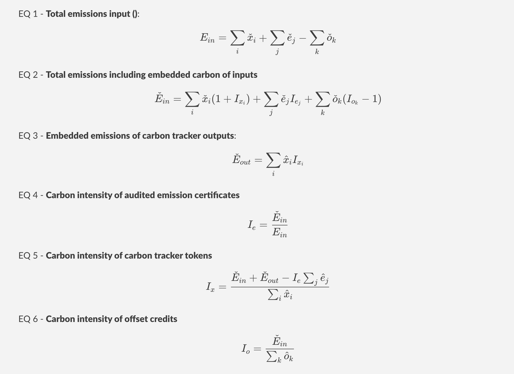
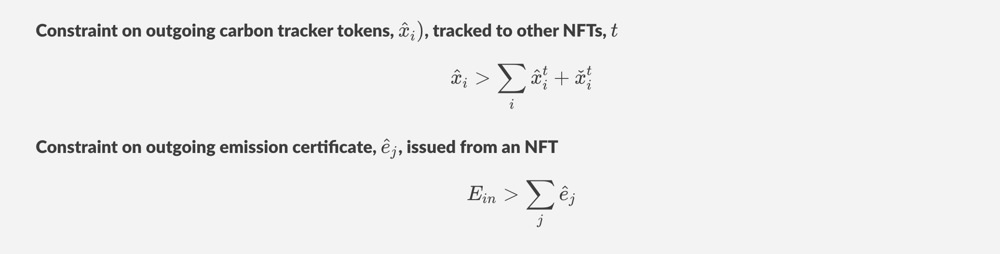

# CarbonTracker token and Contract:

See [the CarbonTracker token for registered industry dealers](#carbontracker-token-for-registered-industry-dealers) section below for updates to the [net-emission-token (NET) network contract](https://github.com/hyperledger-labs/blockchain-carbon-accounting/blob/main/net-emissions-token-network/contracts/NetEmissionsTokenNetwork.sol).

## ERC721Upgradeable contract for carbon tracker NFTs

The Carbon Tracker Contract is used to issue a non fungible tokens (NFT). They represent the emission pofile of a facility that produces industrial goods or a commerical service such as international travel and transportation of goods.

The contract is implemented as a child of the [NET contract](https://github.com/hyperledger-labs/blockchain-carbon-accounting/blob/main/net-emissions-token-network/contracts/NetEmissionsTokenNetwork.sol). Each Carbon Tracker NFT describes the unique emission profile of a product/facility using different NET types as inputs/outputs:
- retied emission certificates, 
- retired/transffered offset credits
- retired (burnt)/transffered carbon tracker tokens

NETs listed within an NFT can be mapped from previous NFT trackerIds. This connects emission profiles of different facilities to achieve embedded emission tracking. See the [CarbonTracker NFT example](#carbon-tracker-nft-example).

### Attribute description  

Each NFT is defined by `_trackerData` mapping to `struct CarbonTrackerDetails`.
Within each tracker previous `trackerIds` are mapped to `struct CarboCBM the NET network
- `_verifyTransferred()`: check that the tokenId output amounts registered as transferred out with what is reported in the NET network 

### Public view function - `carbonIntensity()`

A library of view functions is provided to access contract state, including the `carbonIntensity(trackerId, audited)`. **Never call these in functions that update the network to avoid excessive gas fees**.

This is a recursive function that cycles through all previous trackerIds.
It measures the carbon intensity of offset credits, audited emission certificates, or outgoing carbon tracker tokens.

Note: in equation 4 the carbon intensity of emission certificates is the ratio of total emissions including any embbeded carbon tracked for inputs, over the total emission reported (i.e., >= 1).

### Constraints

The following internal contraints are also applied across all NFTs

## Carbon tracker NFT applications

This service target industries, and their supply chain counterparts, with commercial advantage (and/or policy mandate) to provide embedded emission transparency. 

For example, the [Carbon Border Adjustement Mechanism drafted by the European Commission](https://ec.europa.eu/info/sites/default/files/carbon_border_adjustment_mechanism_0.pdf). It requires importers of targeted energy intensive commodities (e.g., steel, cement, alumininum, fertilizers) to disclose simple and complex (embedded) emissions. These will be subject to carbon import tariffs equivalent to the price of GHG allowances purchased under the European Unions Emission Trading System (EU ETS).  

Another application is the creation of emission performance certificates issued to fuel and other commodity producers. For exmaple, to certify that a producer has low gas flaring and methane leakage on its production. [Flare Intel](https://flareintel.com/) provoides a service that could be used to verify flaring from facilities on a global scale. The World Bank has also set up an [Imported Flared Gas (IFG) index](https://www.ggfrdata.org/#imported-flare-gas-index) as a measure of the embedded flared emission in international oil trade. The Carbon Tracker NFTs could be issued in conjunction with such an index to prove an importer has committed to lowering its IFG index.

### CarbonTracker NFT example

The following digram illustrates the flow of different token typs (see legend on right hand side). Each column or vertical lane identifies the carbon tracker NFT constructed for different industrial facilities:
- Oil & gas producer
- Combined heat and power (CHP) plant 
- Oil Refinery
- Steam methane reforming (SMR) plant for hydrogen fuel production
- Carbon torage facility

## CarbonTracker token for registered industry dealers

TokenTypeId=4 for carbon Tokens issued by registered industry of the Net Emission Token (NET) Network. This supply side token and CarbonTracker contract enable shared emission inventories across organizations and  embedded emission tracking.
Carbon tokens can only be transferred with the approval of the receiving party using the openzepplin ECDSAUpgradeable

Additions/changes to the NetEmissionTokenNetwork contract:
- Role `REGISTERED_INDUSTRY`: new industry actors, self assigned or admin elected
- Role `REGISTERED_INDUSTRY_DEALER`: elected by admin as official Carbon Token industry dealers
- Mapping `_transferredBalances` allows CarbonTracker contract to check that the  balances of a tokenId transffered by a given address do not exceed what was reported in NET. 
- mapping `carbonTransferNonce`: 
    - prevent processing of carbon token transfers (tokenTypeID=4) multiple times. 
    - Used in getTransferHash (see below)
    - Increment in `_beforeTokenTransfer()` hook. When `approveCarbon` is true require `verifySignature()` (see below).
- Modifier `consumerOrDealer(address from,address to)`: modifer for from and to addresses.
    - `from!=address(0)`: if not minting require sender is consumerOrDealer
    - `to!=address(0)`: if not burning require receiver is consumerOrDealer  
- function `_beforeTokenTransfer()` hook:
    - Ensures that requires are enforced for all `safeTransferFrom()` calls 
    - Also applies to issue `super._mint` and retire `super._burn`.
    - if condition `tokenTypeId == 4`, require `verifySignature()`.
- `getTransferHash(from, to ,ids ,amounts)`: create Hash of token transfer 
- `verifySignature()`: require address that signed `getTransferHash()` matches the to address