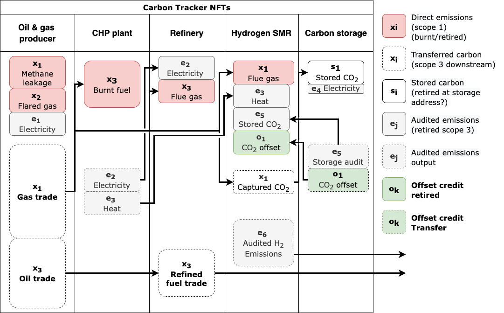

# CarbonTracker token and Contract:

See [the CarbonTracker token for registered industry dealers](#carbontracker-token-for-registered-industry-dealers) section below for updates to the [net-emission-token-network contract](https://github.com/hyperledger-labs/blockchain-carbon-accounting/blob/main/net-emissions-token-network/contracts/NetEmissionsTokenNetwork.sol).

## ERC721Upgradeable contract to create carbon tracker NFTs

TO-DO: This should describe in detail how the CarbonTracker contract is implemented

Each CarbonTracker NFT describes the unique emission profile of a product/facility using different NET types as inputs/outputs:
- retied emission certificates, 
- retired/transffered offset credits
- retired (burnt)/transffered carbon tracker tokens

NETs listed within an NFT can be map from a previous NFT trackerId. This connects emission profiles of different facilities for embedded emission tracking. 

Note: companies with no incentive to provide their consumers with transparent embedded emissions may see no value in this, as it may reflect negatively on their emission performance. This service target industries, and their supply chain counterparts, with commercial advantage (and/or policy mandate) to provide embedded emission transparency. 

One example is the final [Carbon Border Adjustement Mechanism drafted by the European Commission](https://ec.europa.eu/info/sites/default/files/carbon_border_adjustment_mechanism_0.pdf). It requires importers of targeted energy intensive commodities (e.g., steel, cement, alumininum, fertilizers) to disclose simple and complex (embedded) emissions. These will be subject to carbon import tariffs equivalent to the price of GHG allowances purchaed with the European Unions Emission Trading System (EU ETS).  

Another application is the creation of emission performance certificates issued to producers of oil and gas. This couldbe used to certify that a producer has low gas flaring and methane leakage on its production. [Flare Intel](https://flareintel.com/) provoides a service that could be used by the Carbon Tracker contract to verify flaring from facilities globally. The World Bank has also set up an [Imported Flared Gas (IFG) index](https://www.ggfrdata.org/#imported-flare-gas-index) as a measure of the embedded flared emission in international oil trade. The Carbon Tracker NFTs couldbe issued in conjunction with such an index to prove an importer has committed to lowering its IFG index.

### Attribute description  

Each NFT is defined by `_trackerData` mapping to `struct CarbonTrackerDetails`.
Within each tracker previous `trackerIds` are mapped to `struct CarbonTokens`. trackerId 0 is used when no previous tracker NFT is listed.

- The IDs and amounts of NETs are defined as inputs/outputs in the struct 'CarbonTokens' that maps from a unique trackerId.
    - inAmounts are defined as burnt tokens of type 3,4 (audited emissionw, industry carbon tracker) 
    - There are two types of outAmounts:
    1. carbon transfers. Token type 4 for unburnt fuel/feedstock or hydrocarbon bearing materials (e.g. plastics)
    2. audited emissions (type 3) mapped to a unique CarbonTracker id. Used to track embedded emission transfers (e.g. scope 2/3) for non-hydrocarbon fuel/feedstock product outputs

- Other attributes of the tracker NFTs are 
    - trackee: the address the tracker applies to
    - audtior: a registered emission auditor assined to verify this NFT
    - totalEmission: total emissions tracked as inputs  
    - totalAudited: total number of audited emissions certificates issued. Required to be less than totalEmissions.
    - trackerIds: previous tracker NFTs referenced (mapped to CarbonTokens struct)
    - totalOut: map tokenId to total amounts output
    - totalTracked: map tokenId to total amounts tracked by other NFTs

- Other mappings
    - auditedTrackerId maps audited emission token to trackerId
    - offsetTrackerId maps offset credit to trackerId

### Verifications

The contract enforces several verifications each time a trackerId is created or updated.

- `_verifyRetired()`: check that the tokenId input amounts registered as retired by a trackee aligns what is reported in the NET network
- `__verifyTransferred()`: check that the tokenId output amounts registered as transferred out with what is reported in the NET network 

### Public view functions `carbonIntensity()`

A library of view functions is provided to access contract state. These should never be called by functions that update the network to avoid excessive gas fees.
The `carbonIntensity(trackerId,audited)` measure the emission profile of a tracker NFT. 
This is a recursive function that cycles through all previous trackerIds.
It can be used to measure the carbon intensity of audited outgoing emission certificates, or outgoing CarbonTracker token transfers.

**Indices**
$i$: carbon tracker token
$j$: audited emission token
$k$: offset credit

**Tokens**
$\hat{x}_i$: outgoing carbon tracker token $i$ transfer
$\check{x}_i$: incoming burnt carbon tracker token $i$

$\hat{e}_j$: outgoing audited emission token 
$\check{e}_j$: retired audited emission token 
*Note: $\hat{e}_j$ = $\check{e}_j$ since all audited emission are retired by default.*

$\hat{o}_k$: outgoing offset credit
$\check{o}_k$: incoming retired offset credit

**Tracked carbon intensity**
$I_{b_i}$: of burnt carbon tracker token $i$
$I_{e_j}$: of audited emission token $j$
$I_{o_k}$: of carbon offset credit $k$

**Total emissions in**
$$E_{in} = \sum_i{\check{x}_i}+\sum_j{\check{e}_j}-\sum_k{\check{o}_k}$$

Total emissions tracked in (including embedded carbon of inputs):
$$\check{E}_{in} = \sum_i{\check{x}_i(1+I_{x_i})}+\sum_j{\check{e}_jI_{e_j}}+\sum_k{\check{o}_k(I_{o_k}-1)}$$

**Embedded emissions of total carbon tracked out**
 $$\check{E}_{out}=\sum_i{\hat{x}_iI_{x_i}}$$

**Carbon intensity for audited emission certificates**
$$I_e=\frac{\check{E}_{in}}{E_{in}}$$

**Carbon intensity for carbon tracker tokens**
$$I_{x}=\frac{\check{E}_{in}+\check{E}_{out}-I_e\sum_j{\hat{e}_j}}{\sum_i{\hat{x}_i}}$$

**Carbon intensity for offset credits**
$$I_{o}=\frac{\check{E}_{in}}{\sum_k{\hat{o}_k}}$$

### CarbonTracker NFT example

The following digram illustrates the flow of different token typs (see legend on right hand side). Each column or vertical lane identifies the carbon tracker NFT constructed for different industrial facilities:
- Oil & gas producer
- Combined heat and power (CHP) plant 
- Oil Refinery
- Steam methane reforming (SMR) plant for hydrogen fuel production
- Carbon torage facility

## CarbonTracker token for registered industry dealers

TokenTypeId=4 for carbon Tokens issued by registered industry of the Net Emission Token (NET) Network. This supply side token and CarbonTracker contract enable shared emission inventories across organizations and  embedded emission tracking.
Carbon tokens can only be transferred with the approval of the receiving party using the openzepplin ECDSAUpgradeable

Additions/changes to the NetEmissionTokenNetwork contract:
- Role `REGISTERED_INDUSTRY`: new industry actors, self assigned or admin elected
- Role `REGISTERED_INDUSTRY_DEALER`: elected by admin as official Carbon Token industry dealers
- Mapping `_transferredBalances` allows CarbonTracker contract to check that the  balances of a tokenId transffered by a given address do not exceed what was reported in NET. 
- mapping `carbonTransferNonce`: 
    - prevent processing of carbon token transfers (tokenTypeID=4) multiple times. 
    - Used in getTransferHash (see below)
    - Increment in `_beforeTokenTransfer()` hook. When `approveCarbon` is true require `verifySignature()` (see below).
- Modifier `consumerOrDealer(address from,address to)`: modifer for from and to addresses.
    - `from!=address(0)`: if not minting require sender is consumerOrDealer
    - `to!=address(0)`: if not burning require receiver is consumerOrDealer  
- function `_beforeTokenTransfer()` hook:
    - Ensures that requires are enforced for all `safeTransferFrom()` calls 
    - Also applies to issue `super._mint` and retire `super._burn`.
    - if condition `tokenTypeId == 4`, require `verifySignature()`.
- `getTransferHash(from, to ,ids ,amounts)`: create Hash of token transfer 
- `verifySignature()`: require address that signed `getTransferHash()` matches the to address