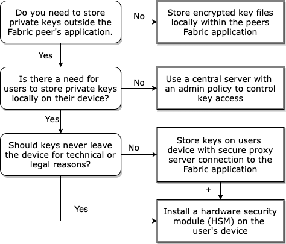

# Secure Identities
This directory provides packages used to secure client key files and setup credential types for signing blockchain transactions. The [emissions-data](../fabric) blockchain currently support two types of identity credential types used by the fabric network:
* cloud-based keystore based on Hashicorp's Vault to securely access secrets.
* keys stored on the user’s external device using a secure (e.g., web-socket) connection.




## Cloud based identity service vs. external keystore

The above figure outlines decision points when designing secure identity types for users of a Fabric application. The first decision is the most basic (store keys locally). Typically, a Fabric SDK will support key files stored directly on the peer's server. Identity files are stored as standard X.509 certificates containing an encrypted PKCS#8 key file and require no external identity management services.

Key files may also be stored separate from the identity credentials outside the Fabric peer on an external database. This option requires custom signing credential types. Two examples are:
1. Private keys and certificates are stored in a cloud-based storage service (e.g., Hashicorp Vault) operated by an organization.
2. Private keys are stored on the user's external device disconnected from the internet unless otherwise requested by the user.

In the first approach, the organization manages its users and controls access to client keys on the secure server. Key owners can issue and authenticate API tokens for Fabric applications (e.g., utility-emissions) to use as the user's identity credentials.  A Vault-X.509 identity credential type is supported in the Fabric application.  The private keys always reside in the Vault server.  While the user can issue tokens from the private key based on the key policy, they do not have physical ownership of the private key.

The major advantage of this approach is that clients are not responsible for communicating with the Fabric network. A single application is used to manage identities of multiple users.  This application could have enhanced security features and policies.  The major disadvantage of this approach is that all private keys are stored in a centralized location.  However secure, it is still a honeypot for hackers to attempt to exploit/corrupt.

The second option allows key files to be physically held by the user, not a third-party app, who then has full control over its use as well.  This is a true decentralized approach, and the major advantage is that each client's private key is never exposed or stored on the organization's application.  The major disadvantage is that clients are responsible for managing their own private keys, as well as communicating with the Fabric network.

Choosing one over the other depends on whether the organization needs align with centralized identity services versus self-management and physical ownership of key files by its users.  A central secured server could be hardened with the best technology and security practices.  Individuals holding their own keys, on the other hand, do not present hackers with a single store containing many access keys. Some considerations for choosing one versus the other include:

- Do users demand full ownership of keys?

- Are there strict key access constraints, such as

    * Security protocols set by a company or government require actual keys (not just the passwords that encrypt them) to be owned by the identity holder.
    * Physical ownership may be required by law.
    * Certain security standards must be upheld for all keys

- Key file physically locked within an external device, such as IoT or embedded devices.  Physical IoT devices may be enrolled with a network using private keys contained within a Hardware Security Module (HSM) that cannot be extracted and stored by a third party.  In this case, a WS-X.509 identity credential uses the secure web-socket identity proxy server to connect to the device.  Other proxy connections/credential types could be used. E.g., gRPC-X.509.

## Connecting external privates keys over web-socket

In the context of the emissions application, the web-socket client security framework supports a wallet installed on a device used by an auditor to sign verified emissions data, like a notary stamp to verify documents.  It could also be installed on a physical device, such as a CO2 sensor or other measurement tool, that relays information about emissions directly to the Fabric network.  Such a device could be a power plant, a transpiration vehicle, or a mobile remote sensor such as an airplane or satellite.  The connection between Fabric and the wallet is made via a [WS-X.509 credential type for signing fabric transactions](https://github.com/hyperledger/cactus/pull/1333), which has been setup within the cactus connector for Fabric.

This security framework requires two packages:

* [ws-wallet](./ws-wallet/README.md) is a wallet which generates the user's offline private key and opens connection to the server

* [ws-identity](./ws-identity/README.MD) is a server to setup and authenticate the web-socket connections coming from wallets.  It can either be bundled within the Fabric application or set up as a standalone endpoint linking a Fabric peer and ws-wallet instance.

The server does not store and never sees the user’s private key. It delivers request to sign various payloads, such as:

- a Certificate Signing Request (CSR) used to construct the WS-X.509 identity file when enrolling with the Fabric application.
- a transaction to the Fabric network to record or query data.

A third package, [ws-identity-client](./ws-identity-client/README.md), is used to setup the backend connection between the fabric app and the ws-identity server. This includes requesting a new session ticket, or access to a web-socket-client connected to a ws-wallet instance.

### Example of a Web Socket Connection

The video from [2021-10-25 Peer Programming Call](https://wiki.hyperledger.org/display/CASIG/2021-10-25+Peer+Programming+Call) from 34:00 to 1:00:00 shows how to use the ws-wallet with Fabric.  The ws-identity server is bundled within the REST API of the utility emissions channel.  The process is:

- Use `ws-wallet new-key` to create a key for a user.  It will prompt you for a password, then store a private key encrypted with the password and return the public key.
- Request a session through the REST API ending in `/identity/webSocket/` using your public key and user name.  The server will open up a session for your wallet to connect and return a sessionId and a connection URL.
- Now connect to the server using `ws-wallet connect <url> <sessionId>`  If the public key of your user agrees with the public key used to open the connection, then the server will return a signature and session key.  You can then use the signature and session key (webSocketKey) to perform additional operations on the REST API server, such as registering and enrolling users and operations on Fabric.

See [docs/ws-session.md](./docs/ws-session.md) for a detailed ECB diagram for setting up a web-socket identity session.

### Using the Web Socket from a Client App

Web socket comes with a REST endpoint to work with client applications such as mobile or web apps.  The client app requests the signature and session key through the REST endpoint.  The user will need to provide the password for the private key to authorize the access.  The REST endpoint will then give the client app the signature and session key, which could then be used to authenticate it on Fabric.

To enable this, go to `secure-identities/ws-wallet` and
```
 npm run start
```

From your client app, call the web-socket server's endpoint at ```http://localhost:9090/session/new``` or the host and port where your ws-wallet REST server is running and provide the name of the user's key and the URL where Fabric's ```/identity/webSocket``` is located so that the REST server could get you the session signature and ID.

Then use that session signature and ID with your requests to Fabric.

## Using the Vault Transit Server

The Vault Transit server is a centralized secure server to store secret keys for a number of users.  The admin can set up different security profiles and then create users.  All users can generate tokens and Transit public keys.  Then the user can access Fabric by providing its token, and the Fabric application will check Vault's Transit key against the user's provided token to validate it.

For example, from 1:14:00 in the video from the [2021-10-25 Peer Programming Session](https://wiki.hyperledger.org/display/CASIG/2021-10-25+Peer+Programming+Call), we see the following sequence:

- Sign into the Vault REST API using the admin token (configured by default)
- Create a new user
- Using the username and password of the new user, create a Vault token
- Create a Transit key for the admin
- Logout as the admin
- Login using the Vault token of the new user
- Create a Transit key for the new user
- From the Fabric REST API, use the register the new user using the Vault admin token.  Write down the enrollment id and enrollment secret
- Now use the Vault new user's token to enroll that user, using the enrollment id and enrollment secret
- Once the user is enrolled, you can perform operations using that user's Vault token

See [Vault Identity README](vault-identity/README.md) for more details on how to use the Vault Transit engine with Fabric.
