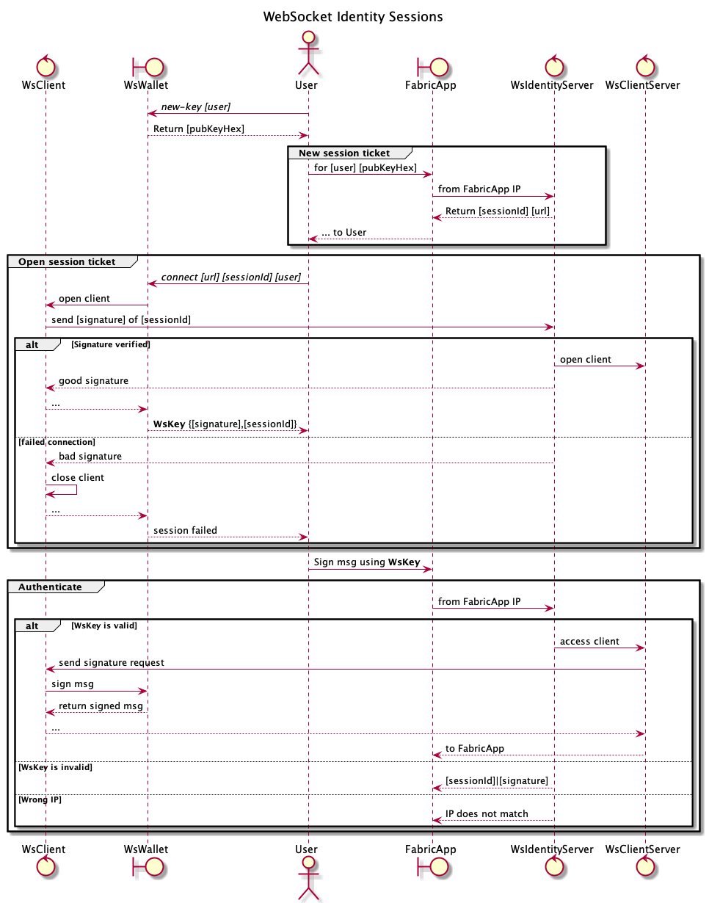

#Entity-control-boundary ws-identity sessions

* control  WsClient         : web-socket client of the external User
* boundary WsWallet         : crypto wallet of the User 
* actor    User             : External user of the Fabric App
* boundary FabricApp        : The Fabric app
* control  WsIdentityServer : web-socket identity server
* control  WsClientServer : User's web-socket client on the identity server

