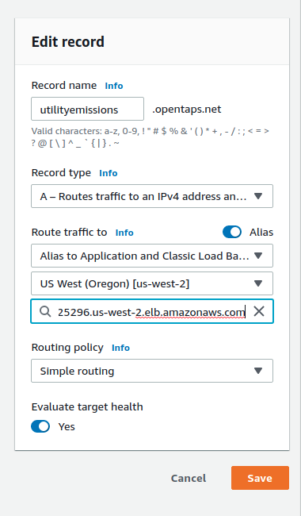

# aws-kubernetes

Deploy utility-emissions-channel app to aws kubernetes

## Create api application Docker image

Run build from utility-emissions-channel directory

    $ docker build -t krybalko/utilityemissions-api:0.0.1 -f aws-kubernetes/Dockerfile .
    $ docker image push krybalko/utilityemissions-api:0.0.1

## Deploy api application Docker image to kubernetes cluster

Create connection config json

    $ cd utility-emissions-channel/aws-kubernetes/ccp-generate
    $ ./ccp-generate.sh

Create ConfigMap from connection config json

    $ cd utility-emissions-channel/aws-kubernetes
    $ kubectl create configmap utilityemissions-api-config --from-file=./ccp-generate/connection-opentaps.json -n fabric-production

Deploy api application

    $ kubectl apply -f ./utilityemissions-api-deployment.yaml -n fabric-production
    $ kubectl apply -f ./ingress-app.yaml -n fabric-production

## Set domain name

Create subdomains on Route 53 for api application, for example utilityemissions.opentaps.net and define simple record similar to example

