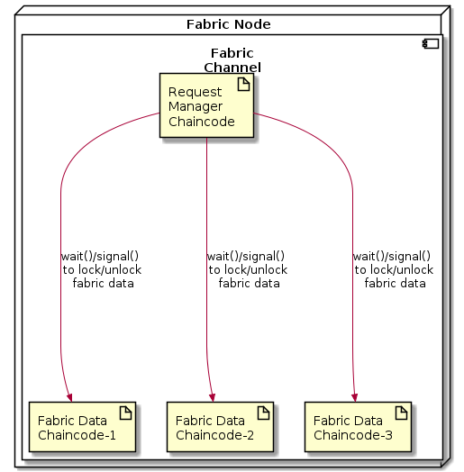
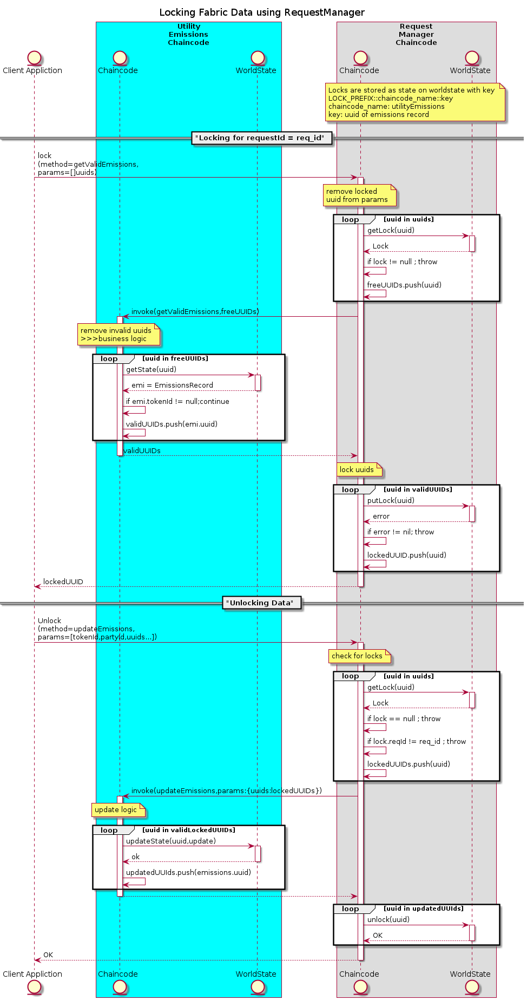
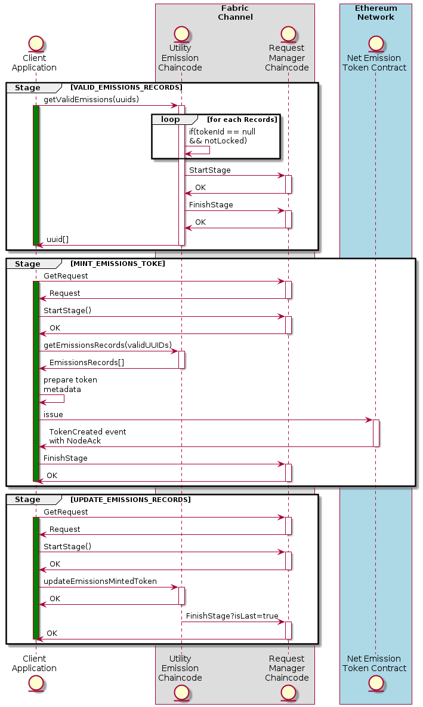

# Request Chaincode

Fabric chaincode for locking fabric data , updating state of a multi blockchain request. Helps attainment of reentrancy with request which require calls to multiple blockading network.

- [Request Chaincode](#request-chaincode)
  - [Abstract](#abstract)
  - [Implementation](#implementation)
    - [Terminologies](#terminologies)
    - [Request Representation](#request-representation)
    - [Methods](#methods)
    - [Locking Fabric Data](#locking-fabric-data)
  - [Carbon Emission Use Case](#carbon-emission-use-case)

## Abstract

Interacting with multiple blockchain networks in order to execute a business logic which requires atomicity of blockchain transactions is not a straightforward task. One approach (naive one) is to make synchronous calls to these blockchain networks one after another. But If any one of the synchronous calls fails , previously succeeded blockchain calls will have to be reverted. Reverting a blockchain transaction is itself a problem to be solved. 

We propose a design and implementation of a distributed and decentralized ecosystem for clients to execute their multi ledger business logic in multiple stages. Each stage can contain one or more blockchain calls. Such that If any one of the stage fails , business logic can still be resumed from the previous stage without having to revert any blockchain transaction present in previously succeeded stages.

## Implementation



### Terminologies

- **request** : A business logic which require calls to multiple blockchain network.
- **stage** : Multi ledger business logic are processed in **stages**. Each **stage** are collection of one or more blockchain transition (preferably only one). **Stage** can be consider as a safe checkpoint from where business logic can again be resumed.
- **FabricDataLock** : In order to prevent two **request** updating same fabric data, a write lock is placed on the data.

### Request Representation

```golang
    // Request : Request Definition for storing request onto the fabric
   type Request struct{
      // ID : key for resolving a Request in chaincode
      ID string

      // FabricDataLocks : details of lock on fabric data
      // key of the map : chaincodeName on which data needs to locked
      // value of the map : list of locked keys on that chaincode 
      FabricDataLocks map[string][]string
      
      // StageData : to keep track of data created during a stage
      // key of the map : unique business logic specific stage Name
      // value of the map : networkType(Ethereum||Fabric||....) => ResolvableData created/output during a stage 
      // which can resolved on given networkType
      StageData map[string]map[string]ResolvableData
      
      // RequestState : overall state of a request
      // can be any one
      // 1. PROCESSING 
      // 2. FINISHED
      RequestState string

      // CurrentStageName : name of currently executing stage
      CurrentStageName string

      // CurrentStageState : state of currently executing stage
      // 1. PROCESSING 
      // 2. FINISHED
      // 3... also business specific state
      CurrentStageState string
      
      // CallerID : id of user (from certificate) executing this request
      // CallerId = fmt.Sprintf("%s_%s",mspId,userCommonName) || msp
      // CallerId = msp , means anyone one from the organization can resume the request (when required)
      CallerID string

      // CreatedOn : epoch timestamp of request creation
      CreatedOn int64
   }


   // ResolvableData : data/assets which can resolved on given networkType created/output during a stage 
   // will be required by upcoming stage
   // example tokenId of the minted token during tokenMinting stage need to be stored for updateEmissionsTokenId stage
   // these data are only for business logic to understand
   type ResolvableData struct{
       // NetworkType : name of the blockchain network where
       // data/asset has been created
       // Fabric
       // Ethereum
       NetworkType string

       // ContractAddress : address of the contract
       // for ethereum network : it is simply contractAddress
       // for fabric network : it is channelName::chaincodeName
       ContractAddress string

       // CreatedKeys : list of keys created by those contract
       // example : 
       /*
            {
                // tokenId of minted token on ethereum
                tokenId : 0x115.......
            }
       */ 
       CreatedKeys map[string]string

       // Output : output generate during the stage
       // which may required by upcoming stages
       // Business logic specific field 
       // example : after fetching uuids of valid emission records
       // these uuid will be required to mint the token and update emission records
       /*
          {
            uuids : []string,
          }
       */
       Output map[string]interface
   }
```
### Methods

List of supported method by request manger chaincode

- Init
  - Description : called only once to initialize request chaincode
  - Input :
    - Channel Name string: Name of the channel on which request chaincode is deployed
  - Output : NULL
- StartStage
  - Description : called before starting a **stage** at client side.
  - Input :
    - RequestId string : request id for which a stage need to be started. if RequestId is not present on chaincode, called stage is consider as first stage of the request. 
    - allowAnyOneFromMSP bool (if this stage is a first stage) : if true will allow anyone from caller's organization can resume the request
    - Name : of the stage
    - FabricDataLocks  `map[string][]string` : list of key of fabric data to be locked present on different chaincode.
    - lockExpirationMs int64 : expiration time (in ms) of the lock. to prevent and identify deadlock.
    - FabricDataUnlocks `map[string][]string` : unlock previously locked fabric data if lock is no longer needed
    - StageData `map[string]ResolvableData` networkId => ResolvableData : Resolvable Data on blockchain so that upcoming stages can use it.
  - Output
    - LockedFabricData map[string][]keys : chaincodeName => locked keys
- UpdateStage
  - Description : update currently running stage
  - Inputs
    - RequestID string
    - StageData `map[string]ResolvableData` networkId => ResolvableData : update some data created/output during the stage, so that upcoming stages can use it.
    - NewCurrentStageState string : business specific logic
- FinishStage
  - Description : Finish currently running stage
  - Input :
    - RequestId
    - isLast bool : is this stage last stage of the request? if true all fabricDataLocks are removed
- GetRequest
  - Description : Returns request
    - InputID : RequestID
    - Output : Request

### Locking Fabric Data

Chaincode on which data to be locked are present ,needs to support two method. These methods will be called by Request manager chaincode.

- Wait
  - Description : place a write lock on fabric data, lock in worldstate are stored with key := `"LOCKER::${KEY}"`
  - Input
    - RequestId : requestId against which lock needs to placed
    - keys `[]string` : list of worldstate key for which lock need to placed
    - lockExpirationMs int64: expiration time (in ms) of the lock. to prevent and identify deadlock.
- Signal
  - Description : remove write lock on fabric
  - Input
    - keys `[]string` : list of worldstate key for which lock needs to removed.


**Flow of Locking Fabric Data taking carbon emissions chaincode**

## Carbon Emission Use Case

Multi ledger business logic **request** :
- User Input
  - `uuids:string[]` , identifier for emission records
  - addressToIssue : address of issuee to whom minted token is to be issued
- Fetches valid emissions records from `UtilityChannelChaincode` --- 1
- mint emission token on ethereum --- 2
- update tokenId of valid emissions records , fetched in `first` step --- 3

Flow



**NOTE**
- For request audibility place requestId into metadata of the token